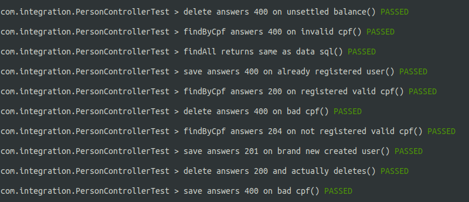
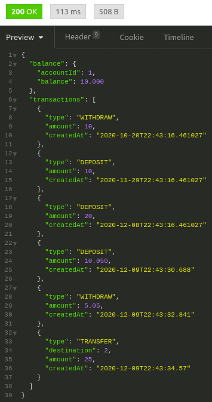

# banking challenge
### defined rules:
* to create an account it is necessary a name and person's cpf (brazilian public doc), but only one account per person
* when depositing, the client receives .5% as a bonus. when withdrawing, 1% will be extra charged
* negative balances are not allowed
* between account transfers are free and unlimited
* it's necessary to check transaction history
### tech stack
* docker
* postgres and h2(testing)
* gradle
* kotlin
* spring (web, data, security, test)
### build instructions
0. since this project is dockerized, it's necessary to have only docker itself installed
1. `/gradlew clean build` will run unit and integrations tests and generate the artifact
2. `docker run --userns=host --rm -v /var/run/docker.sock:/var/run/docker.sock -v $PWD:$PWD -w=$PWD docker/compose build` will download docker-compose image and use it to build necessary images
3. `docker run --userns=host --rm -v /var/run/docker.sock:/var/run/docker.sock -v $PWD:$PWD -w=$PWD docker/compose up` will start the images and lock current terminal with container output logs
4. `docker run --userns=host --rm -v /var/run/docker.sock:/var/run/docker.sock -v $PWD:$PWD -w=$PWD docker/compose down -v --remove-orphans` will stop and remove running containers and remove any remaning volumes

To manually run some API calls, please click on this button:

### features
##### basic auth on all apis
##### people
* create (if their cpf is valid and not used)
* find all and by cpf
* delete people (if their account is settled)
##### transactions
* deposit, withdraw and transfer between accounts (if funds are sufficient, following the percentage rule defined above)
##### history
* check current balance and transaction history (ranged in days defined by a parameter)

### screenshots:

integration tests:

history:

